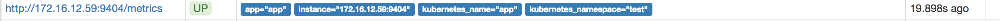

# JBoss EAP - JMX Exporter Prometheus Metrics


## Build and Deploy

```
    oc new-build .
    
    oc new-app -i jboss-eap-prometheus --name=app
```


## Active JMX Exporter
    
```
    export JBOSS_HOME=/opt/eap
    oc set env dc/app PREPEND_JAVA_OPTS="-javaagent:${JBOSS_HOME}/prometheus/jmx-prometheus.jar=9404:${JBOSS_HOME}/prometheus/config.yaml"
    
    oc annotate svc/app prometheus.io/scrape='true'
    oc annotate svc/app prometheus.io/port='9404'
   
```

## Check the targets in Prometheus

url: https://prometheus-openshift-metrics.example.org/targets



# Reference

* https://github.com/prometheus/jmx_exporter
